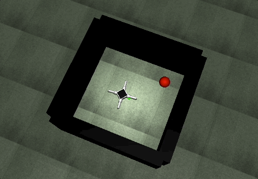
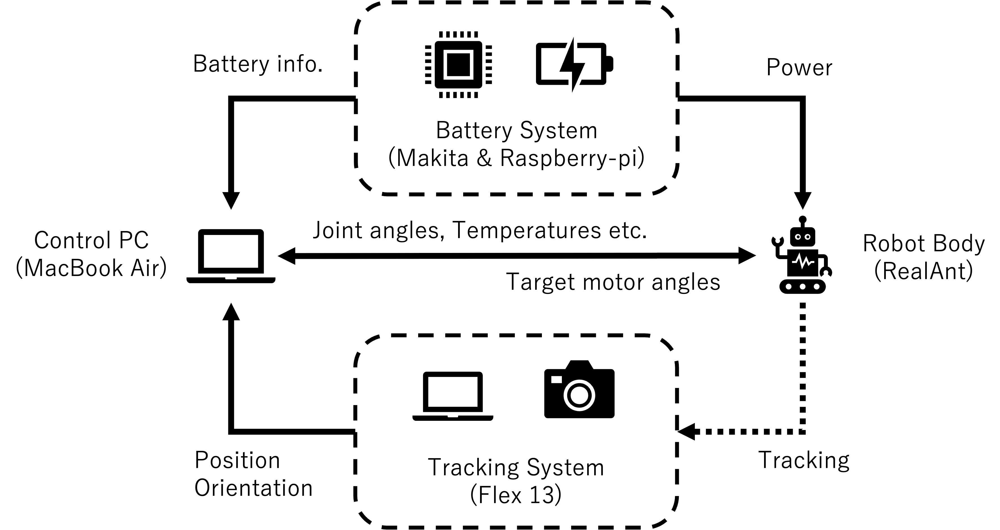
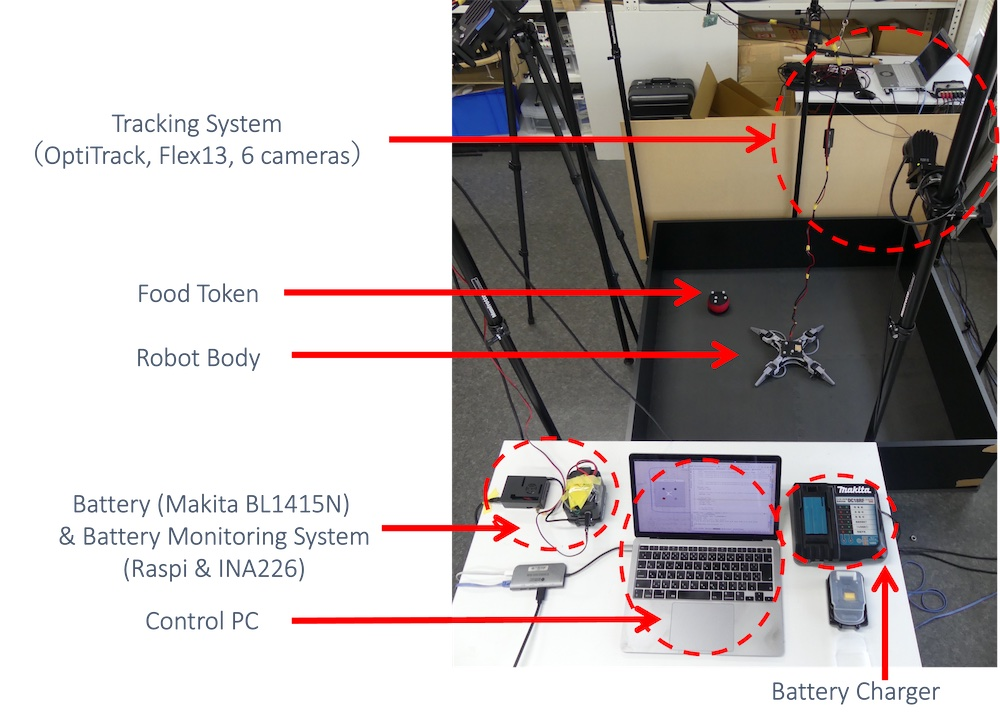

# Neural Homeostat Experiment Code (Simulation and Real Robots)

## Requirements
- python==3.11 (tested in Mac OSX 12.2)

## Installation of core software
```bash
# (create a virtual environment if necessary)
conda create -n robot_hrrl python=3.11
conda activate robot_hrrl

# downloading this repository
git clone git@github.com:ugo-nama-kun/neuralhomeostat_robot.git

# install simulator
git clone git@github.com:ugo-nama-kun/playroom_env.git
pip install ./playroom_env
pip install torch pygame zmq imageio scipy matplotlib wandb tensorboard

# downgrade setuptools if you faced 'pkg_resources' import errors.
# pip install setuptools==81.0
```
It will take few minutes to install.

## Running optimized model in the simulation
```bash
# move to this repository and run.
cd neuralhomeostat_robot

# To run simulation. IS_SIM=True in the code (Line 23).
python run_experiment.py
```

Example of the behavior (Ctrl-C to terminate the experiment).


## Running behavior optimization in the simulation

```bash
bash policy_optimization.sh
```

You can see the progress of the optimization using tensorboard.
```bash
tensorboard --logdir=runs
```
The trained model is saved in `saved_model/PlayroomBase-v2__ppo_cooling__{seed}__{time_stamp}`.

## Running real robot experiments
### System Overview
| Hardware                   | Name                           |
|----------------------------|--------------------------------|
| Controller and Managing PC | Macbook Air (M1, 2020, 16GB)   |
| Robot hardware             | RealAnt (Ote Robotics)         |
| Battery Monitoring System  | Raspberry Pi 4, INA226         |
| Battery                    | Makita BL1415N                 |
| Tracking System            | OptiTrack Flex13 -based system |





### Robot Body (Realant)
RealAnt hardware information: https://github.com/OteRobotics/realant

- Servo motors AX-12A: https://emanual.robotis.com/docs/en/dxl/ax/ax-12a/
- How to get voltage of the motor: https://emanual.robotis.com/docs/en/dxl/ax/ax-12a/#present-voltage
- How to get motor temperatures: https://emanual.robotis.com/docs/en/dxl/ax/ax-12a/#present-temperature-43

### Battery and Monitoring System
The robot’s motor was powered by an external lithium-ion battery (Makita BL1415N). By connecting a power monitoring
IC (INA226, Texas Instruments Inc.) to the battery’s power terminal, the battery’s current voltage and the amount of charge
consumed [C] since the start of monitoring could be measured.

- Makita BL1415N: https://www.makita.co.jp/product/detail/?&cat=14.4V&catm=14.4V%E3%83%AA%E3%83%81%E3%82%A6%E3%83%A0%E3%82%A4%E3%82%AA%E3%83%B3%E3%83%90%E3%83%83%E3%83%86%E3%83%AA&model=14.4V%E3%83%AA%E3%83%81%E3%82%A6%E3%83%A0%E3%82%A4%E3%82%AA%E3%83%B3%E3%83%90%E3%83%83%E3%83%86%E3%83%AA&acce=&btry=on
- INA226: https://www.ti.com/product/INA226

#### Software installation for battery monitoring (Raspberry-pi side)

1. Enable ssh by `sudo raspy-config` -> Interface Options -> SSH 
2. Set static IP address (192.168.1.101 by default in this app)
3. Run the below installation script at the home directory of your raspberry-pi:

```bash
cd ~
git clone git@github.com:ugo-nama-kun/neuralhomeostat_robot.git
cd neuralhomeostat_robot
sh install_realant.sh
```

### Tracking System (OptiTrack configurations)
Markers attached to the robot and a food token were tracked using a motion capture system (Flex13, Acuity Inc.) composed of six cameras. The measured position and orientation were used to construct the agent’s exteroceptive observations and to record the experiment.

The tracking software **Motive** was used, and the following rigid bodies were defined for tracking.


1. Make two rigid bodies: ANT (on the top of the robot) and FOOD (on the top of the target object)
2. Streaming ID should be ANT = 1, FOOD = 2 (can be setup in Motive RigidBody setting)


### Control-Experiment PC (MacBook side)
Installation of python packages.
```bash
# install necessary packages. Assuming python 3.11
pip install gymnasium>=0.27.1 numpy<=1.23.3 rel websocket-client==1.4.1 ping3 pyserial pyzmq hooman

# install optitrack package
# Optitrack broadcast data to 192.168.1.36 and it is "Y-up" setting.
cd ~
git clone https://github.com/mje-nz/python_natnet
cd python_natnet
pip install -e .
cd -
```

First, run the robot control server in a terminal window.
```bash
# Configure network params in network.py
vim network.py

# Run server for the robot control. 
python start_robot_manager.py
```

Next, run the robot experiment in a different terminal window.
```bash
# To run the real robot experiment. IS_SIM=False in the code (Line 23).
python run_experiment.py
```

#### Test code for the system configulation
Test 1: Test run. Move realant randomly.
```bash
python test_system.py
```

Test 2: Walking test. Realant walks forward.
```bash
python test_walk.py
```


## Tips

#### Monitoring robot temperatures

```bash
python start_robot_manager.py
# another shell window
python start_robot_monitoring.py
```


#### zmq returns errors.
kill `python env_server.py` if thread is alive. look for pid by `ps ax | grep python`.

#### enable/disable the battery monitoring script in rasberry-pi after the installation

```bash
# enable
sudo cp setup_files/start_realant.service /etc/systemd/system 
sudo systemctl enable start_realant.service
```

```bash
# disable
sudo systemctl disable start_realant.service
```

#### Raspberry-pi settings in this repo.
```
raspi settings:

username: realant
```

display tips: https://qiita.com/karaage0703/items/97808dfb957b3312b649

#### Raspi4 is not working if you got the following errors.
```bash
- Failed to get present position 0xFF
- Failed to get present temperature 0x80
```

## License (MIT)
Copyright (c) 2026 Naoto Yoshida

Permission is hereby granted, free of charge, to any person obtaining a copy of this software and associated documentation files (the "Software"), to deal in the Software without restriction, including without limitation the rights to use, copy, modify, merge, publish, distribute, sublicense, and/or sell copies of the Software, and to permit persons to whom the Software is furnished to do so, subject to the following conditions:

The above copyright notice and this permission notice shall be included in all copies or substantial portions of the Software.

THE SOFTWARE IS PROVIDED "AS IS", WITHOUT WARRANTY OF ANY KIND, EXPRESS OR IMPLIED, INCLUDING BUT NOT LIMITED TO THE WARRANTIES OF MERCHANTABILITY, FITNESS FOR A PARTICULAR PURPOSE AND NONINFRINGEMENT. IN NO EVENT SHALL THE AUTHORS OR COPYRIGHT HOLDERS BE LIABLE FOR ANY CLAIM, DAMAGES OR OTHER LIABILITY, WHETHER IN AN ACTION OF CONTRACT, TORT OR OTHERWISE, ARISING FROM, OUT OF OR IN CONNECTION WITH THE SOFTWARE OR THE USE OR OTHER DEALINGS IN THE SOFTWARE.